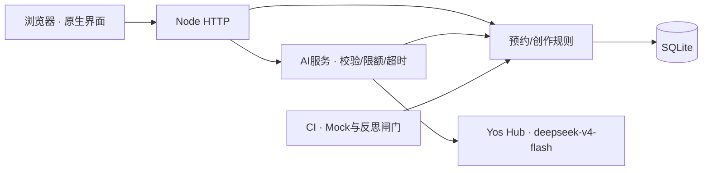

# Borrow Lab · Demo Day路演稿
2026-10-08提前准备。作者蒲嘉洋。没有正式路演、老师反馈、成绩或比赛结果。

## 30秒介绍
大家好，我是蒲嘉洋。“借一下 · Borrow Lab”面向校园创作者。你可以先说想做什么，系统从真实设备库给出组合，再核对预约台账、替换冲突设备并预约。我独立完成产品与质量验证，AI辅助实现与审计；模型推荐也要经过代码核对，设备和空闲信息不会凭空生成。

## 3分钟版
**0:00–0:25 痛点。** 拍摄前不知借什么，更不知几件能否同时借到。我们把分类查询变成“我要做什么”，连接场景、装备与空闲。本机原型尚未以真实校园用户量证明需求规模。

**0:25–1:05 核心流程。** 首页→轻量Vlog→智能推荐，模型解析场景，给库内设备与用途。加入方案，看准备度/日期/时段；添加替换保持上下文。

**1:05–1:45 AI与预约。** 模型收到真实Catalog和匿名预约，ID校验与空闲由服务端完成。冲突时Smart Replace给同能力替代；预约提交再次检查唯一性，成功后我的预约核对。当前逐件预约，不是批量预约。

**1:45–2:15 架构/测试/CI。** 原生HTML/CSS/JS、Node22、SQLite，规则/仓储/HTTP/AI分层。Key只在后端.env/环境变量。自动测试mock、真模型手动验收；86组已有通过日志，最新CI按真实链接展示。

**2:15–2:40 真实Bug。** HTTP中文跨块乱码先复现失败，再拼原始Buffer统一解码，回归通过。周报只剩标题用六部分事实引用和最多一次重试解决。复杂方案优化仍会截断，明确失败保留方案，不能假装通过。

**2:40–3:00 未来。** 本人验收→真实实验室试点→身份/权限/领用归还/部署备份→AI正确率与费用→PWA跨端。视觉让人愿探索，真实规则让人敢预约。

## 5分钟版
**0:00–0:30** 使用30秒介绍。

**0:30–1:00 痛点。** 用户带采访/Vlog/直播目标而来，用场景与方案降低选装成本。样例台账/账号不是校园试点，价值需真实用户验证。

**1:00–1:45 流程。** 首页→场景→智能推荐→方案。展示28件/10类、搜索、详情、加减替换。准备度表示时段可用/本人已锁定，不冒充电量或守约率。

**1:45–2:30 AI价值。** Yos Hub/deepseek-v4-flash解析意图，代码校验设备/日期并核对空闲。周报由服务端算六部分事实、模型选有依据建议；样本少明确不足，不以预约量编造冲突概率。展示六项真实验收/usage，不显示Key。

**2:30–3:10 方案/冲突。** 添加不跳顶、检查冲突/替换、单件预约再次检测、取消释放后重约。成功卡与我的预约给完成感；本地账号隔离不是公网安全登录。

**3:10–3:50 工程。** 浏览器→Node→业务→SQLite；AI只由后端调平台。Design Tokens/原创图/桌面测量/键盘减弱动画。CI跑mock测试、只读MCP、十章反思闸门；展示最终审计链接，不用固定passing。

**3:50–4:30 Bug故事。** 中文分块是真实缺陷；隔离Git演练故意破坏冲突后定位/revert恢复，明确二者区别。头像/空账户偏好有回归。周报过短已修，复杂方案优化截断仍待处理。

**4:30–5:00 未来。** 真实试点、身份/权限、领用归还、共享部署备份、AI成本稳定性、跨端。应用商店是方向，当前未上架/未获奖，依用户反馈迭代。

## 技术架构

## 断网90秒备用路线
明确“此时实时AI不可用，改用规则场景组合”→轻量Vlog→方案→明天下午→查空闲→预约成功→我的预约→个人中心。展示此前真实模型证据并明确非当场响应。[完整故障路线](Demo彩排.md)。

本人计时/90秒视频/正式Demo/真实反馈仍待发生。新版未部署未合主干、复杂AI优化未通过。提前tag与自查四项通过不等于正式路演完成。

